# NewsPulse Data Pipeline Architecture

Sơ đồ dưới đây mô tả toàn bộ kiến trúc hệ thống của NewsPulse, từ bước thu thập dữ liệu (Collection), xử lý luồng (Stream Processing), lưu trữ (Analytics Serving) cho đến quản trị (Quality Operations) và giao diện hiển thị (Dashboard).

```mermaid
flowchart TD

subgraph group_collection["Collection"]
  node_crawlers["Scrapy Crawlers"]
  node_rawstore[("Raw Object Storage")]
  node_mongodb[("MongoDB Raw Data")]
end

subgraph group_processing["Stream Processing"]
  node_kafka["Kafka"]
  node_sparkjob["Spark Streaming Job<br/>[streaming_job.py]"]
  node_kafkaconsumer["Kafka Consumer<br/>[kafka_consumer.py]"]
  node_nlp["Vietnamese NLP"]
  node_nlpwriters["NLP Writers<br/>[nlp_writers.py]"]
  node_sinkwriters["Stream Sink Writers<br/>[sink_writers.py]"]
end

subgraph group_serving["Analytics Serving"]
  node_clickhouse[("ClickHouse Warehouse")]
  node_api["FastAPI Application<br/>[main.py]"]
  node_analytics["Analytics Services<br/>[analytics.py]"]
  node_routes["Analytics and SSE Routes"]
  node_auth["Authentication Routes<br/>[auth.py]"]
  node_mongoauth[("User Data Store<br/>[database.py]")]
end

subgraph group_operations["Quality Operations"]
  node_orchestrator["Airflow Schedules"]
  node_quality["Data Quality Checks"]
  node_alerts["Anomaly and Crisis Alerts"]
  node_telegram["Telegram Reports<br/>[telegram_alert.py]"]
  node_backfill["Historical Backfills"]
  node_monitoring["Health Monitoring"]
end

subgraph group_dashboard["Dashboard"]
  node_frontend["Next.js Dashboard<br/>[page.tsx]"]
  node_frontendapi["API Client<br/>[api.ts]"]
end

node_user(("Dashboard User"))
node_sources(("News and Social Sources"))

node_sources -->|"crawl content"| node_crawlers
node_orchestrator -.->|"schedule crawls"| node_crawlers
node_crawlers -->|"store raw HTML"| node_rawstore
node_crawlers -->|"persist items"| node_mongodb
node_crawlers -->|"publish articles"| node_kafka
node_kafka -->|"stream records"| node_kafkaconsumer
node_sparkjob -->|"run consumer"| node_kafkaconsumer
node_sparkjob -->|"apply enrichment"| node_nlp
node_sparkjob -->|"write NLP results"| node_nlpwriters
node_sparkjob -->|"write stream data"| node_sinkwriters
node_nlpwriters -->|"store enrichments"| node_clickhouse
node_sinkwriters -->|"store processed data"| node_clickhouse
node_orchestrator -.->|"schedule validation"| node_quality
node_orchestrator -.->|"schedule alerting"| node_alerts
node_alerts -->|"query metrics"| node_clickhouse
node_alerts -->|"send notifications"| node_telegram
node_orchestrator -.->|"send daily reports"| node_telegram
node_backfill -->|"load history"| node_clickhouse
node_frontend -->|"request API data"| node_frontendapi
node_frontendapi -->|"call endpoints"| node_api
node_api -->|"register routes"| node_routes
node_routes -->|"request analytics"| node_analytics
node_analytics -->|"query warehouse"| node_clickhouse
node_routes -->|"dispatch auth"| node_auth
node_auth -->|"read and write users"| node_mongoauth
node_user -->|"use dashboard"| node_frontend
node_monitoring -.->|"check health"| node_mongodb
node_monitoring -.->|"check health"| node_kafka

click node_crawlers "https://github.com/hquan07/news_flow/tree/main/crawlers/newspulse_crawler"
click node_orchestrator "https://github.com/hquan07/news_flow/tree/main/data_platform/dags"
click node_kafka "https://github.com/hquan07/news_flow/tree/main/infrastructure/kafka_utils"
click node_sparkjob "https://github.com/hquan07/news_flow/blob/main/spark/streaming/streaming_job.py"
click node_kafkaconsumer "https://github.com/hquan07/news_flow/blob/main/spark/streaming/kafka_consumer.py"
click node_nlp "https://github.com/hquan07/news_flow/tree/main/spark/processing"
click node_nlpwriters "https://github.com/hquan07/news_flow/blob/main/spark/streaming/nlp_writers.py"
click node_sinkwriters "https://github.com/hquan07/news_flow/blob/main/spark/streaming/sink_writers.py"
click node_clickhouse "https://github.com/hquan07/news_flow/tree/main/data_platform/warehouse"
click node_api "https://github.com/hquan07/news_flow/blob/main/api/main.py"
click node_analytics "https://github.com/hquan07/news_flow/blob/main/api/services/analytics.py"
click node_routes "https://github.com/hquan07/news_flow/tree/main/api/routers"
click node_auth "https://github.com/hquan07/news_flow/blob/main/api/routers/auth.py"
click node_mongoauth "https://github.com/hquan07/news_flow/blob/main/api/database.py"
click node_frontend "https://github.com/hquan07/news_flow/blob/main/frontend/src/app/page.tsx"
click node_frontendapi "https://github.com/hquan07/news_flow/blob/main/frontend/src/lib/api.ts"
click node_quality "https://github.com/hquan07/news_flow/tree/main/data_platform/data_quality"
click node_alerts "https://github.com/hquan07/news_flow/blob/main/data_platform/dags/anomaly_alerting_dag.py"
click node_telegram "https://github.com/hquan07/news_flow/blob/main/infrastructure/monitoring/telegram_alert.py"
click node_backfill "https://github.com/hquan07/news_flow/tree/main/data_platform/warehouse"
click node_monitoring "https://github.com/hquan07/news_flow/tree/main/infrastructure/monitoring"

classDef toneNeutral fill:#f8fafc,stroke:#334155,stroke-width:1.5px,color:#0f172a
classDef toneBlue fill:#dbeafe,stroke:#2563eb,stroke-width:1.5px,color:#172554
classDef toneAmber fill:#fef3c7,stroke:#d97706,stroke-width:1.5px,color:#78350f
classDef toneMint fill:#dcfce7,stroke:#16a34a,stroke-width:1.5px,color:#14532d
classDef toneRose fill:#ffe4e6,stroke:#e11d48,stroke-width:1.5px,color:#881337
classDef toneIndigo fill:#e0e7ff,stroke:#4f46e5,stroke-width:1.5px,color:#312e81
classDef toneTeal fill:#ccfbf1,stroke:#0f766e,stroke-width:1.5px,color:#134e4a
class node_crawlers,node_rawstore,node_mongodb,node_user toneBlue
class node_kafka,node_sparkjob,node_kafkaconsumer,node_nlp,node_nlpwriters,node_sinkwriters toneAmber
class node_clickhouse,node_api,node_analytics,node_routes,node_auth,node_mongoauth toneMint
class node_orchestrator,node_quality,node_alerts,node_telegram,node_backfill,node_monitoring toneRose
class node_frontend,node_frontendapi,node_sources toneIndigo
```

