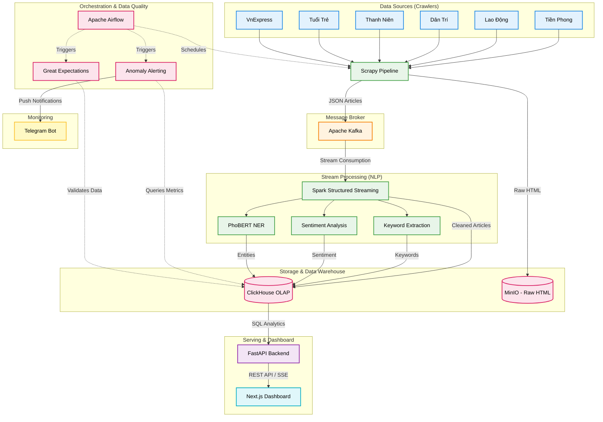

# NewsPulse

**Realtime News Intelligence Platform**

A real-time news analysis platform that collects and processes articles from Vietnam's three largest online newspapers. The system runs entirely on-premise without cloud dependencies.

---

## Key Features

- **Automated Crawling** from VnExpress, Tuổi Trẻ, and Thanh Niên via Scrapy crawlers.
- **Streaming Pipeline** with Kafka → Spark Structured Streaming.
- **Vietnamese NLP** — keyword extraction, Named Entity Recognition (PhoBERT), and sentiment analysis.
- **Real-time Data Warehouse** powered by **ClickHouse**, offering sub-second query performance for analytics.
- **Data Quality & Alerting** — automated Airflow DAGs using Great Expectations for validation, with Telegram bot integration for anomaly detection.
- **Historical Backfilling Tools** — Optimized offline scripts for fast ingestion of massive historical dumps to ClickHouse and batch NLP extraction using multiprocessing.
- **REST API** powered by FastAPI serving analytics endpoints.
- **Custom Dashboard** built with **Next.js**, React, Recharts, and TailwindCSS (optional) for real-time visualization — tracking trends, source comparisons, entity networks, volume spikes, and system alerts.
- **Monitoring** — Docker healthchecks and Python-based monitoring scripts.
- **100% Containerized** — a single `start.sh` or `docker compose up -d` brings up the entire infrastructure.

## Tech Stack

| Layer | Technology |
|-------|-----------|
| Crawling | Python, Scrapy, BeautifulSoup4, feedparser |
| Message Broker | Apache Kafka |
| Stream Processing | Apache Spark Structured Streaming |
| Object Storage | MinIO (Raw HTML Storage) |
| Real-time OLAP | ClickHouse |
| Backend API | FastAPI |
| Dashboard Frontend | Next.js, React, Recharts |
| Infrastructure | Docker, Docker Compose |

## Architecture



## Installation & Setup

### Requirements

- Docker Engine ≥ 24.0
- Docker Compose ≥ 2.20
- RAM ≥ 8GB (16GB recommended)
- Disk ≥ 20GB

### Quick Start

**1. Clone repository**
```bash
git clone https://github.com/hquan07/News_Flow.git
cd News_Flow
```

**2. Setup Environment Variables**

Before running the application, you need to configure the environment variables. The project provides an `.env.example` file which contains the required variable structure without any sensitive passwords.

```bash
cp .env.example .env
nano .env
```

**3. Start the Infrastructure**
We provide a master startup script `start.sh` to initialize the system components in the correct order.

```bash
chmod +x start.sh
./start.sh
```

Or you can use `make`:
```bash
make up
```

**4. Access Points**
- **Next.js Dashboard:** `http://localhost:3000`
- **FastAPI Docs:** `http://localhost:8001/docs`
- **Spark Master UI:** `http://localhost:8082`

## Project Structure (Enterprise Standard)

```text
News_Flow/
├── api/                  # FastAPI Backend (Dashboard endpoints)
├── config/               # Shared configurations
├── crawlers/             # Scrapy spiders (VnExpress, DanTri, etc)
├── data_platform/        # Data engineering & Quality
│   ├── dags/             # Airflow DAGs (Legacy/Optional)
│   ├── data_quality/     # Great Expectations suites
│   └── warehouse/        # dbt models, migrations, SQL scripts
├── frontend/             # Next.js Dashboard
├── infrastructure/       # DevOps, Docker, Kafka tools, Monitoring, Perf
│   ├── docker/           # Dockerfiles & docker-compose.yml
│   ├── kafka_utils/      # Kafka producers/consumers
│   ├── monitoring/       # Health checks
│   └── performance/      # Benchmarks
├── spark/                # Apache Spark Structured Streaming pipeline
├── tests/                # Unit/Integration tests
├── Makefile              # Helper commands
└── start.sh              # Master startup script
```

## Dashboard

The Next.js dashboard includes 5 primary views:

| Page | Content |
|-------|---------|
| **Overview** | KPI cards, articles by hour, category distribution, sentiment breakdown, average crawl latency |
| **Trending** | Top trending keywords, temporal trends, and keyword co-occurrences |
| **Sources** | Source composition by category and article ingestion speed |
| **Entities** | People, Locations, and Organizations tracking |
| **Alerts** | Active system alerts, data anomaly detection history, and automated Telegram notifications |

## Monitoring

| Component | Description |
|-----------|-------------|
| Docker Healthchecks | Integrated health checks for all services (Kafka, ClickHouse, Spark, API) |
| `/health` | FastAPI endpoint for deep-checking the API |
| `health_monitor.py` | CLI tool for system validation returning standard exit codes (0/1) |
| Telegram Bot | Push notifications for data pipeline anomalies and latency spikes |
| Great Expectations | Automated data quality validation suites running in Airflow |

## Performance Tuning

Key optimizations applied:
- **ClickHouse**: Replaced PostgreSQL to act as a real-time OLAP store, bringing query times from seconds down to milliseconds.
- **Spark Streaming**: Enabled Adaptive Query Execution (AQE), matched shuffle partitions to logical parallelism, used Kryo serialization, and G1GC.
- **Next.js Frontend**: Implemented React `useTransition`, smart polling with `Promise.allSettled`, and Server-Sent Events (SSE) for auto-reconnects.

## License

MIT

## Author

**Quan** — [GitHub](https://github.com/hquan07)